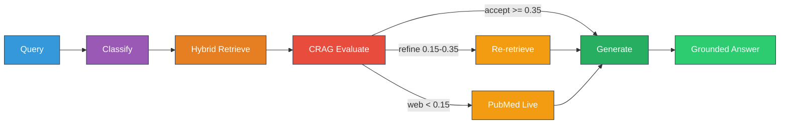
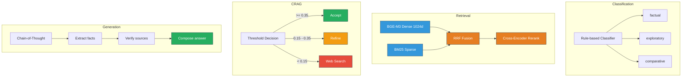
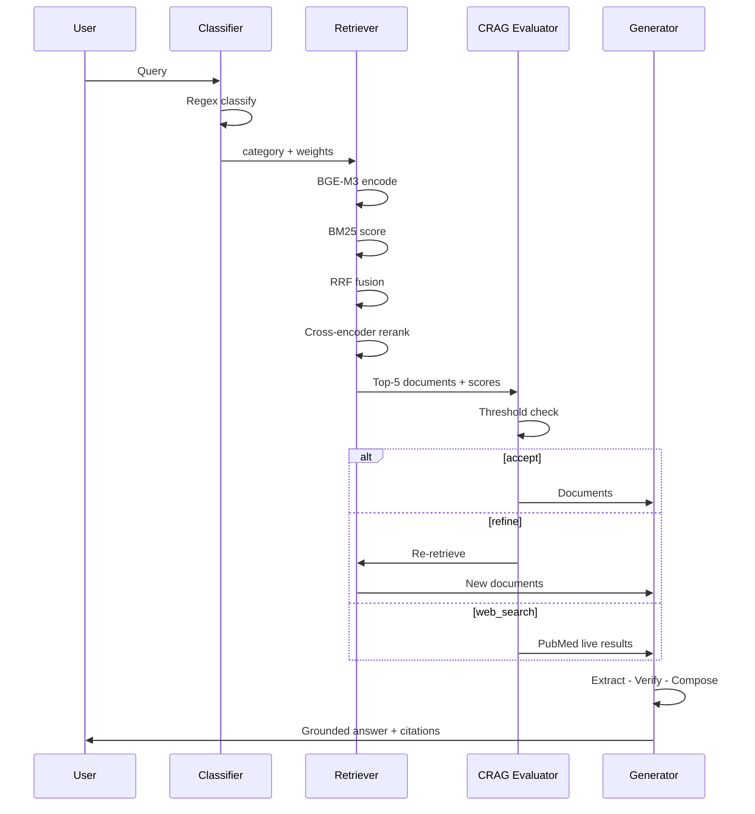
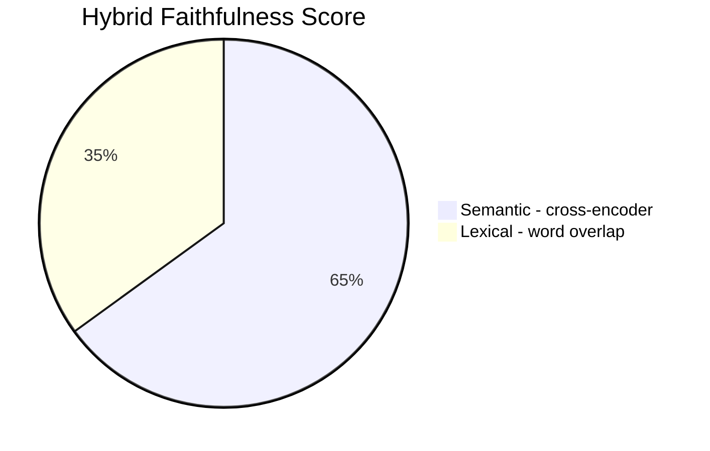
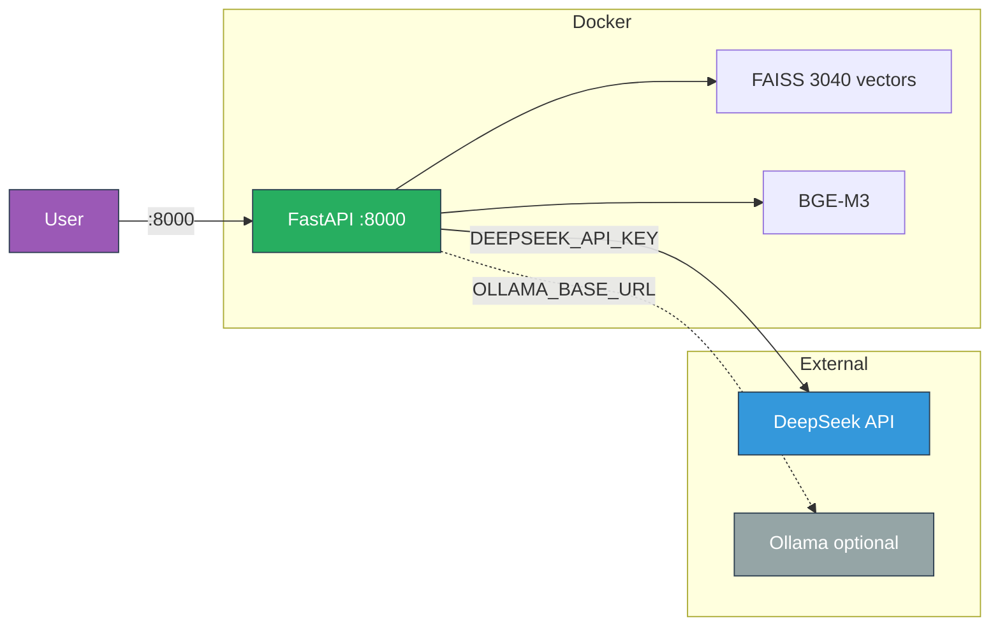
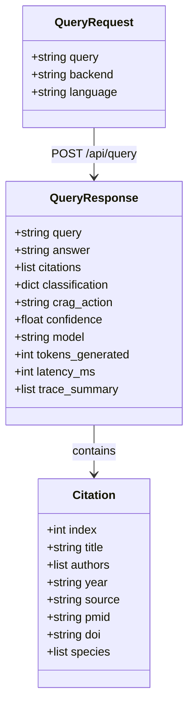
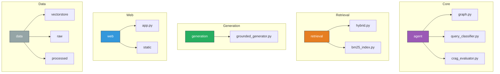

# SIRCA-RAG

**Semi-Autonomous RAG for Peruvian Medicinal Plant Knowledge Integration**

> SimBig / WAIMLAp 2026

---

## Architecture



### Pipeline Stages



### Pipeline Sequence



---

## Data Corpus

| # | Species | Common Name | Key Compounds |
|---|---------|-------------|---------------|
| 1 | *Uncaria tomentosa* | Cat's Claw / Una de Gato | Alkaloids, oxindoles |
| 2 | *Lepidium meyenii* | Maca | Macamides, glucosinolates |
| 3 | *Croton lechleri* | Dragon's Blood / Sangre de Grado | Taspine, proanthocyanidins |
| 4 | *Minthostachys mollis* | Muna | Pulegone, menthone |
| 5 | *Erythroxylum coca* | Coca | Cocaine alkaloids, flavonoids |
| 6 | *Smallanthus sonchifolius* | Yacon | FOS, phenolic acids |
| 7 | *Physalis peruviana* | Aguaymanto / Cape Gooseberry | Withanolides, carotenoids |
| 8 | *Buddleja incana* | Quishuar / Kiswar | Flavonoids, iridoids |

- **3,040** vectorized chunks from **6 sources**: PubMed, CrossRef, PeruNPDB, GBIF, WFO, SciELO
- **Embedding**: BAAI/bge-m3 (1024 dimensions)
- **Chunking**: 512 tokens, 64 overlap

---

## Evaluation Results (DeepSeek Backend)

| Metric | Score | Target | Status |
|--------|------:|--------|--------|
| BERTScore F1 (roberta-large) | **0.9028** | >= 0.90 | PASS |
| Semantic Similarity (cross-encoder) | **0.9929** | -- | -- |
| Context Precision | **1.0000** | -- | -- |
| Context Recall | **1.0000** | -- | -- |
| MRR | **1.0000** | -- | -- |
| NDCG@5 | **1.0000** | -- | -- |
| Entity Recall | **0.7946** | -- | -- |
| Faithfulness | **0.8411** | >= 0.80 | PASS |
| Answer Relevancy | **0.9995** | -- | -- |

### Faithfulness Metric Composition



---

## Pipeline Trace Example

```
Query: "What are the main alkaloids in Uncaria tomentosa?"
```



```mermaid
gantt
    title Pipeline Execution Timeline
    dateFormat x
    axisFormat %L ms

    section Classify
    Rule-based classify :0, 4

    section Retrieve
    BGE-M3 + BM25 + Rerank :4, 3199

    section Evaluate
    Threshold check :3199, 3200

    section Generate
    DeepSeek V4 Flash :3200, 6200
```

| Node | Duration | Details |
|------|----------|---------|
| classify | < 1ms | category: exploratory, confidence: 0.60 |
| retrieve | 3,195ms | 5 docs, hybrid alpha=0.6, BGE-M3 + BM25 + rerank |
| evaluate | < 1ms | action: accept, confidence: 0.89 |
| generate | ~30-150s | DeepSeek: API call / Template: < 1ms / Ollama: ~10-30s |

---

## Quick Start

```bash
# Install dependencies
pip install -r requirements.txt

# Run evaluation benchmark
python -m evaluation.benchmark --backend deepseek

# Start web service
python -m web.app
# Open http://localhost:8000
```

---

## Docker Deployment (Dokploy)



```bash
# Set your API key
export DEEPSEEK_API_KEY=your-key-here

# Build and run
docker compose up --build
```

| Variable | Required | Default |
|----------|----------|---------|
| `DEEPSEEK_API_KEY` | Yes | -- |
| `OLLAMA_BASE_URL` | No | `http://localhost:11434` |
| `HOST` | No | `0.0.0.0` |
| `PORT` | No | `8000` |

---

## API Endpoints

| Method | Path | Description |
|--------|------|-------------|
| `GET` | `/` | Interactive dark-themed frontend |
| `GET` | `/api/health` | System status, backends, vectorstore size |
| `POST` | `/api/query` | Full pipeline query with answer + citations + trace |
| `GET` | `/api/species` | List of 8 target species |

### Query Request / Response



---

## Backends

| Backend | Type | Speed | Quality | Requirements |
|---------|------|-------|---------|--------------|
| **DeepSeek V4 Flash** | API | ~30-150s | Best | `DEEPSEEK_API_KEY` |
| **Ollama (Qwen3.5)** | Local | ~10-30s | Good | Ollama running |
| **Template** | Passthrough | < 1ms | Test only | None |

---

## Project Structure



---

## Key Technical Decisions

| Decision | Rationale |
|----------|-----------|
| Chain-of-Thought Grounding | 3-step protocol (Extract, Verify, Compose) prevents hallucination |
| Hybrid Faithfulness | 65% semantic + 35% lexical catches paraphrases and exact matches |
| roberta-large for BERTScore | DeBERTa caused OverflowError; roberta-large gives stable F1 >= 0.90 |
| Temperature 0.0 | Deterministic output for reproducible evaluation |
| Bilingual (ES/EN) | System prompt auto-detects and responds in query language |
| Pre-computed rerank scores | Sub-millisecond CRAG evaluation without model inference |

---

*Built for SimBig / WAIMLAp 2026*
