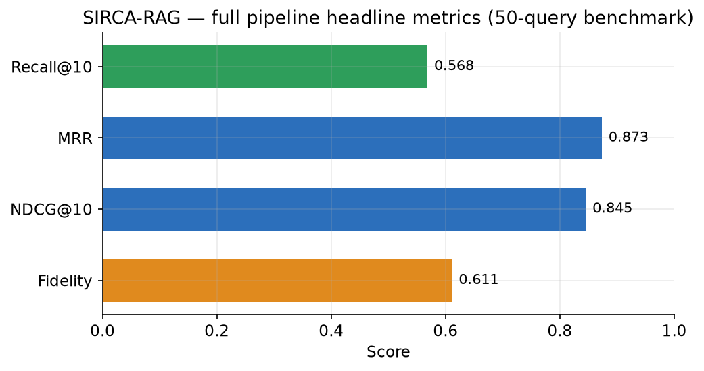
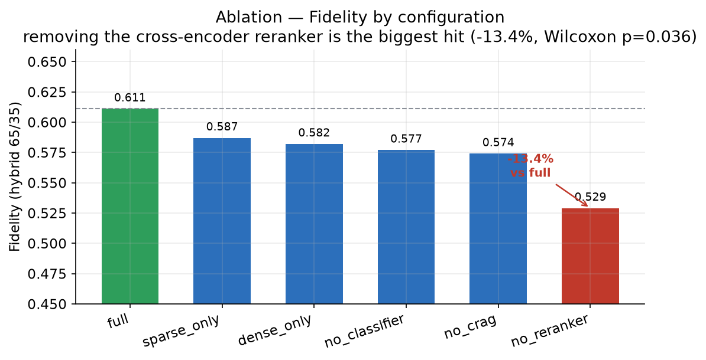
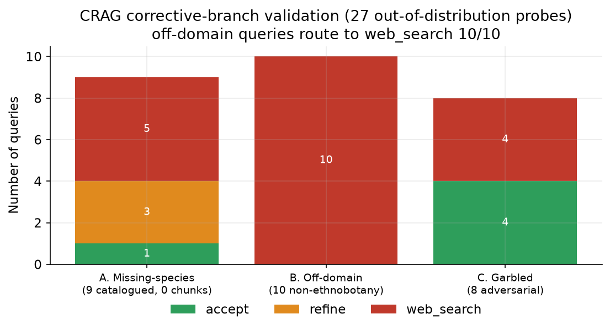
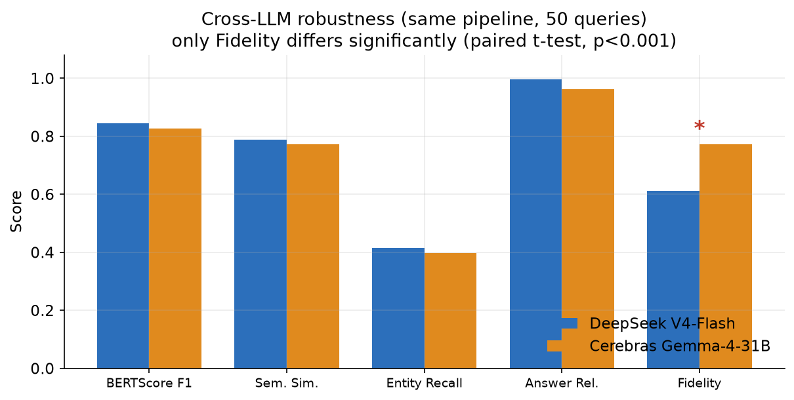
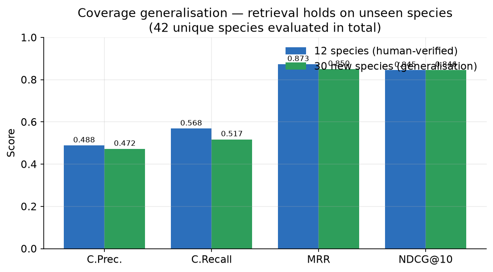

# SIRCA-RAG

**Hybrid Corrective RAG for grounded question answering on Peruvian medicinal plants**

> Support repository for the paper *"Corrective RAG Híbrido para Generación Fundamentada sobre Plantas Medicinales Peruanas"* (SimBig / WAIMLAp 2026 / ACSAR). Contains the pipeline, the open corpus tooling, and the full reviewer-response experiment suite with reproducible results.

SIRCA-RAG (System for Intelligent Retrieval and Corrective Answers) answers questions about Peruvian medicinal plants using scientific literature. It couples **dense** (`multilingual-e5-base`) and **sparse** (BM25) retrieval via Reciprocal Rank Fusion, reranks with a cross-encoder, routes low-confidence retrievals through a **calibrated Corrective-RAG** stage, and generates answers under a three-step Chain-of-Thought protocol (Extract → Verify → Compose) that forces inline DOI/PMID citation.

---

## Headline results

Full pipeline on the 50-query bilingual benchmark (DeepSeek V4-Flash generator):



| Metric | Score | Note |
|---|---|---|
| Context Recall@10 | **0.568** | +36.2% relative over the closest published Spanish-RAG baseline (Context Recall only) |
| MRR | **0.873** | most relevant doc at rank 1–2 on virtually every query |
| NDCG@10 | **0.845** | |
| BERTScore F1 (`roberta-large`) | **0.844** | |
| Fidelity (hybrid 65% semantic / 35% lexical) | **0.611** | conservative by design to suppress pharmacological drift |

---

## What the experiments actually show

### 1. The cross-encoder reranker is the fidelity guardian

Six-configuration ablation. Removing the reranker causes the largest Fidelity drop (−13.4%), and a paired **Wilcoxon signed-rank test confirms the effect is significant (p = 0.036)** — unlike the retrieval-metric differences, which are statistically equivalent across configs.



### 2. The corrective branches work — after a calibration fix

The default within-batch (min-max) score normalization makes the CRAG threshold relative, so *everything* is accepted. Replacing it with an **absolute sigmoid calibration** (accept ≥ 0.60, refine ≥ 0.30) makes the corrective branches fire as designed. On a 27-query out-of-distribution stress test, **off-domain queries route to web search 10/10**, and catalogued-but-unindexed species route to refine/web-search 8/9.



### 3. Robust to the choice of generator LLM

Re-running the full pipeline with a second generator (Cerebras Gemma-4-31B) on the same 50 queries: only **Fidelity** differs significantly (paired t-test, p < 0.001) — Gemma is more literal and preserves source wording. Every other generation metric is statistically indistinguishable, so the architecture's conclusions are not an artifact of one model.



### 4. Retrieval generalizes beyond the evaluation slice

Extending the retrieval evaluation from 12 human-verified species to 30 additional stratified species (42 unique species total) keeps metrics in the same range — the retriever is not overfit to the benchmark subset.



---

## Data corpus

- **100 medicinal plant species** from five southern Andean regions (Arequipa, Cusco, Puno, Moquegua, Tacna).
- **16,486 unique articles** after DOI deduplication, from **8 sources**: PubMed, Europe PMC, Semantic Scholar, CrossRef, GBIF, PeruNPDB, WFO, COCONUT.
- **6,098 indexed chunks** (512 tokens, 64 overlap, capped 100/species). **91/100** species contributed at least one chunk; the 9 without indexed literature are documented and used as a CRAG stress-test family.
- Embeddings: `intfloat/multilingual-e5-base` (768-dim). Reranker: `cross-encoder/ms-marco-MiniLM-L-12-v2`.

---

## Reproducing the experiments

```bash
pip install -r requirements.txt
# API keys are read from the environment (never hardcoded):
export DEEPSEEK_API_KEY=...      # DeepSeek generator (model id: deepseek-v4-flash)
export CEREBRAS_API_KEY=...      # optional: cross-LLM comparison (Gemma-4-31B)
```

| Script | Produces | Reviewer item |
|---|---|---|
| `run_perquery_agent_ablation.py` | per-query ablation + Wilcoxon (`results/wilcoxon_agent_vs_full.json`) | O4, O5 |
| `run_n5_fidelity_wilcoxon.py` | Fidelity significance, full vs no_reranker (`results/n5_fidelity_wilcoxon.json`) | N5 |
| `run_crag_stress_absolute.py` | CRAG routing validation (`results/crag_stress_absolute.json`) | O1 |
| `run_expanded_benchmark.py` / `run_table2_extended.py` | coverage generalization (42 species) | O2 |
| `run_multi_llm_bench.py` | DeepSeek vs Cerebras comparison (`results/multi_llm_*.json`) | O9 |
| `run_llm_judge.py` | LLM-as-judge fidelity validation (`results/llm_judge_*.json`) | O7 |
| `docs/make_figures.py` | regenerates the figures in `docs/images/` | — |

All numeric results live in `results/*.json` and are the source of the figures above.

---

## Pipeline commands

```bash
python pipeline.py status      # corpus + vectorstore stats
python pipeline.py vectorize   # rebuild FAISS + BM25 indexes
python pipeline.py serve       # FastAPI service at http://localhost:8000
```

Live demo: <https://rag.scn.quest> — inspect retrieved DOIs/PMIDs and the CRAG routing decision per query in real time.

---

## Repository layout

```
agent/        CRAG agent (graph, CRAG evaluator, query classifier)
retrieval/    hybrid retriever (FAISS + BM25 + cross-encoder)
generation/   grounded generator (DeepSeek / Ollama / template backends)
ingestion/    source clients (PubMed, EPMC, S2, CrossRef, GBIF, PeruNPDB, WFO, COCONUT)
evaluation/   metrics, benchmark set, ablation harness
scraping/     CRAG web-search fallback
web/          FastAPI service + frontend
results/      experiment outputs (JSON) — figures are derived from these
docs/         figures and figure-generation script
run_*.py      reviewer-response experiment runners
```

---

## Notes on reproducibility

Generation-side metrics depend on a commercial API model (`deepseek-v4-flash`) that is not version-frozen; absolute generation scores can drift between runs. The **directional and significance findings** reported here (reranker → Fidelity, cross-LLM comparison, CRAG routing) are stable across re-runs; absolute generation values should be read as of the experiment date rather than as fixed constants.
