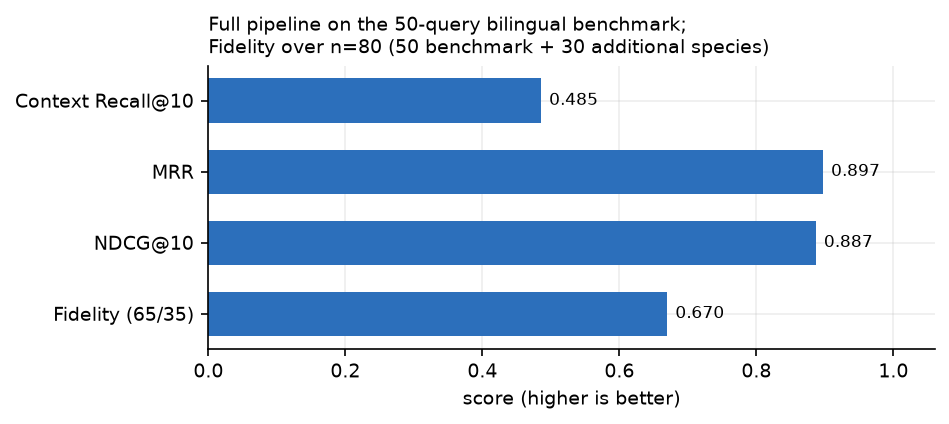
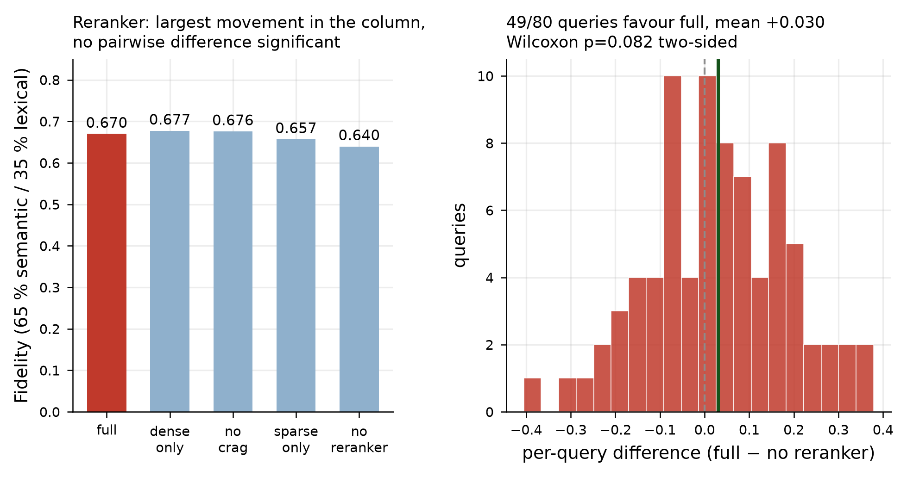
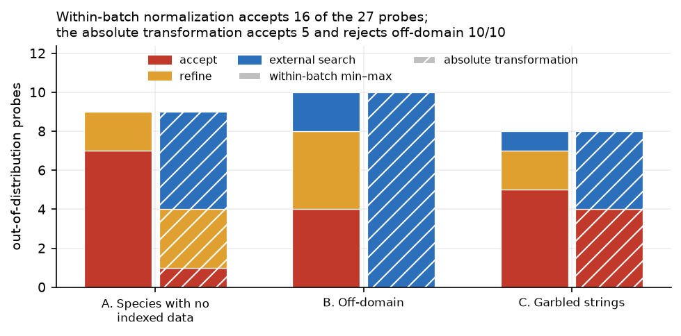
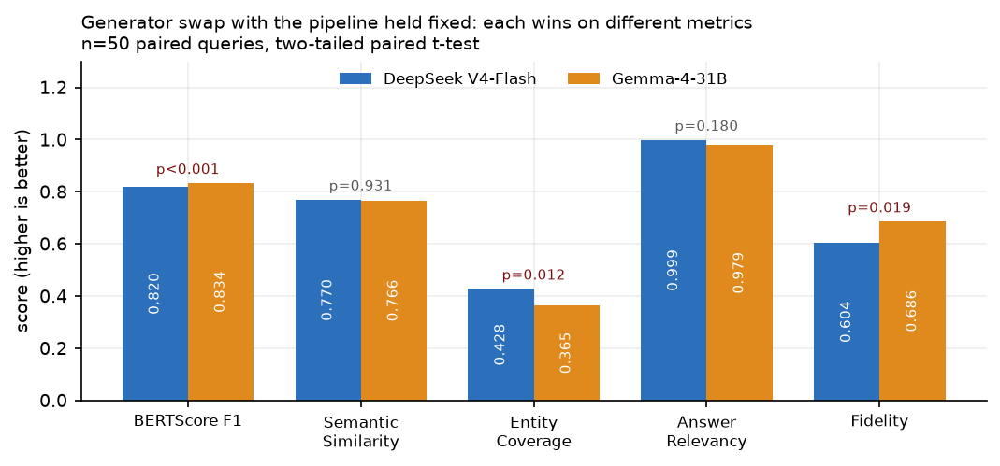
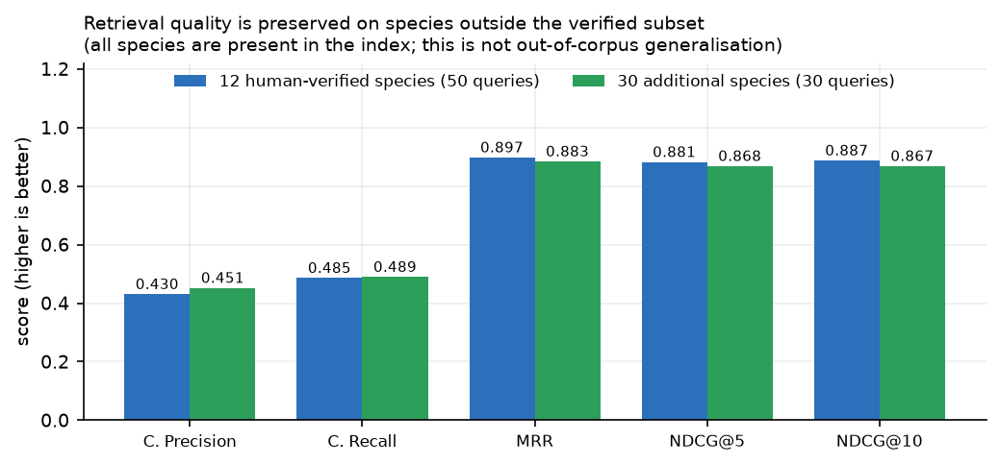

# SIRCA-RAG

**Hybrid Corrective RAG for grounded question answering on Peruvian medicinal plants**

> Support repository for the paper *"Hybrid Corrective RAG for Grounded Generation on
> Peruvian Medicinal Plants"* (SimBig / WAIMLAp 2026 / ACSAR). Contains the pipeline, the
> corpus tooling, and the full reviewer-response experiment suite with reproducible results.

SIRCA-RAG (System for Intelligent Retrieval and Corrective Answers) answers questions about
Peruvian medicinal plants from scientific literature. It couples **dense**
(`multilingual-e5-base`) and **sparse** (BM25) retrieval through a weighted Reciprocal Rank
Fusion, reranks with a cross-encoder, routes low-confidence retrievals through a
**Corrective-RAG** stage with per-document absolute scoring, and generates under a
three-step Chain-of-Thought protocol (Extract → Verify → Compose) that forces inline
DOI/PMID citation.

> **Revision note (2026-09).** The numbers below are the reviewer-response re-run on the
> final index (32,569 chunks, cap removed). The first submission reported a 6,098-chunk
> index; both sets of JSON outputs are kept in `results/` (`*_uncapped.json` are the new
> ones). Several corrections to this repository are listed under
> [Corrections in this revision](#corrections-in-this-revision).

---

## Headline results

Full pipeline on the 50-query bilingual benchmark (DeepSeek V4-Flash generator):



| Metric | Score | Note |
|---|---|---|
| Context Recall@10 | **0.485** | not compared numerically against prior work; the closest Spanish-language system (Collanqui et al.) evaluates a single-document, k=1 setup |
| MRR | **0.897** | most relevant document at rank 1–2 on the large majority of queries |
| NDCG@10 | **0.887** | |
| BERTScore F1 (`roberta-large`) | **0.820** | |
| Fidelity (hybrid 65 % semantic / 35 % lexical) | **0.670** | n=80; conservative by design to suppress pharmacological drift |

---

## What the experiments show

### 1. The cross-encoder reranker helps Fidelity directionally, not significantly

Removing the reranker lowers Fidelity from **0.670** to
**0.640** (4.5 % relative). `full` beat
`no_reranker` in **all six runs** of this test, but formal significance did not hold: the
paired Wilcoxon p ranged from 0.00023 to 0.160, and the final run gives
**p=0.082 two-sided / 0.041 one-sided**.
Per query, **49 of 80**
favour `full` — a majority, not a uniform improvement. Full history in
`results/fidelity_runs_history.csv`.

At the retrieval level all five configurations are statistically equivalent to `full` (no
p below 0.05; `results/ablation_uncapped.json`).

Fidelity is now reported for **all five** configurations — the first submission left three as
"n/a" (`results/fidelity_all_configs_uncapped.json`):

| Configuration | Fidelity | vs `full` | p |
|---|---|---|---|
| `dense_only` | 0.677 | +1.1 % | 0.680 |
| `no_crag` | 0.676 | +0.9 % | 0.996 |
| **`full`** | **0.670** | — | — |
| `sparse_only` | 0.657 | -1.9 % | 0.412 |
| `no_reranker` | 0.640 | −4.5 % | 0.082 |

No pairwise difference is significant, and removing the reranker is the largest movement in
the column. `dense_only` returns the **same Top-10 as `full` on every query**, so it feeds the
generator an identical context: the 0.008 between them is the generator's own run-to-run
noise, and the reranker effect is about four times that floor.



### 2. The corrective branches work — and here is the head-to-head evidence

The default within-batch (min–max) normalization makes the CRAG threshold relative to the
batch. Replacing it with a **per-document absolute transformation** (accept ≥ 0.60, refine
≥ 0.30) is what makes the corrective branches reachable. Measured on the *same* 27
out-of-distribution probes, one retrieval pass, two decision functions
(`results/normalization_comparison.csv`):

| Query set | n | min–max accepts | absolute accepts |
|---|---|---|---|
| Species with no indexed data | 9 | 7 | 1 |
| Off-domain | 10 | 4 | **0** |
| Garbled strings | 8 | 5 | 4 |
| **All probes** | 27 | **16** | **5** |

Note the qualification: min–max does **not** suppress the corrective routes entirely — it
still fires 11 of 27 — because the rule also requires 20 % of the batch above threshold.
The claim is quantitative, not absolute. The accept threshold sits on a plateau: any value
in [0.50, 0.85] gives the same corrective behaviour
(`results/threshold_sweep.csv`).



### 3. Robust to the choice of generator — each wins on different metrics

Same pipeline and same retrieved contexts, 50 paired queries, DeepSeek V4-Flash vs
Gemma-4-31B (served through SambaNova):

| Metric | DeepSeek | Gemma-4-31B | p |
|---|---|---|---|
| Entity Coverage | **0.428** | 0.365 | **0.012** |
| Answer Relevancy | **0.999** | 0.979 | 0.180 |
| Semantic Similarity | **0.770** | 0.766 | 0.931 |
| BERTScore F1 | 0.820 | **0.834** | **<0.001** |
| Fidelity | 0.604 | **0.686** | **0.019** |

Gemma's Fidelity advantage comes from the **semantic** component, not the lexical one: the
margin is largest at a purely semantic weighting (+0.108) and vanishes at a purely lexical
one (+0.035, p=0.249) — see `results/fidelity_weight_sweep.csv`. This corrects the
mechanism stated in the first submission.



### 4. Retrieval generalizes beyond the evaluation slice

Widening from the 12 human-verified species (50 queries) to 30 additional species (30
template queries) leaves the two subsets statistically indistinguishable: MRR
0.897 → 0.883, NDCG@10
0.887 → 0.867. All
of those species are present in the index, so this is **not** out-of-corpus generalization.



### 5. The bilingual property is asymmetric

Retrieval is language-neutral (no metric differs significantly between the 18 Spanish and 32
English queries), but generation is not: Fidelity is **0.468 on Spanish** versus **0.680 on
English** (p=0.001) and BERTScore 0.808 vs 0.826 (p=0.007). The indexed literature is almost
entirely in English, so a Spanish query retrieves English context and must answer in Spanish
(`results/language_breakdown.csv`).

---

## Data corpus

- **100 catalogued species** from five southern Andean regions (Arequipa, Cusco, Puno,
  Moquegua, Tacna); **91** have indexed literature.
- **16,486 unique records collected** after DOI deduplication from 8 sources. Of these,
  **6,481 documents / 32,569 chunks** are indexed — only records whose text mentions a
  catalogued species enter the index.
- What is indexed is **title + abstract**, not full text (median ≈1,461 characters per
  document). Chunks are **512 characters** with 64 characters of overlap (median 51 words).
- **Per-source contribution to the index**: PubMed, CrossRef, Europe PMC and Semantic
  Scholar supply all indexed chunks. **GBIF, PeruNPDB, WFO and COCONUT supply none** — they
  were queried for taxonomic and phytochemical validation, but their records are
  field-structured rather than prose.
- The 9 species with no indexed literature are kept deliberately as a CRAG stress-test family.
- Embeddings: `intfloat/multilingual-e5-base` (768-dim). Reranker:
  `cross-encoder/ms-marco-MiniLM-L-12-v2`.

---

## Reproducing the experiments

```bash
pip install -r requirements.txt
# API keys are read from the environment (never hardcoded):
export DEEPSEEK_API_KEY=...      # DeepSeek generator (model id: deepseek-v4-flash)
export SAMBA_APIKEY=...          # optional: cross-LLM comparison (gemma-4-31B-it)
```

| Script | Produces | Reviewer item |
|---|---|---|
| `pipeline.py vectorize` | FAISS + BM25 index (no per-species cap since this revision) | corpus description |
| `rerun_retrieval_tables.py` | ablation + Wilcoxon + coverage table on any index (`results/ablation_uncapped.json`, `table1_uncapped.json`) | R1-1, R2-2a, R2-2b |
| `rerun_generation.py` | cross-LLM benchmark, LLM-as-judge, Fidelity significance (`results/*_uncapped.json`) | R2-3, R2-7 |
| `rerun_fidelity_all_configs.py` | Fidelity for the ablation configurations previously marked n/a | R2-2b (Limitation iii) |
| `run_norm_and_pool.py` | min–max vs absolute head-to-head + pre-reranker pool metrics (`results/norm_pool_*.json`) | R2-1c, R2-2a |
| `docs/make_figures_rev1.py` | regenerates `docs/images/` with legends outside the data area and explicit p-values | R1-2, R2-5 |

All numeric results live in `results/` and are the source of every figure and table. Files
named `*_uncapped.*` come from the final index; the unsuffixed ones are the first
submission's.

---

## Pipeline commands

```bash
python pipeline.py status      # corpus + vectorstore stats
python pipeline.py vectorize   # rebuild FAISS + BM25 indexes
python pipeline.py serve       # FastAPI service at http://localhost:8000
```

Live demo: <https://rag.scn.quest>

---

## Repository layout

```
agent/        CRAG agent (graph, evaluator with absolute per-document scoring, classifier)
retrieval/    hybrid retriever (FAISS + BM25 weighted RRF + cross-encoder)
generation/   grounded generator (DeepSeek / Ollama / template backends)
ingestion/    source clients (PubMed, EPMC, S2, CrossRef, GBIF, PeruNPDB, WFO, COCONUT)
evaluation/   metrics, benchmark set, ablation harness
scraping/     CRAG web-search fallback
web/          FastAPI service + frontend
results/      experiment outputs (JSON/CSV) — figures are derived from these
docs/         figures and figure-generation scripts
paper/        LaTeX sources (main_en.tex first submission, main_en_rev1.tex revision)
run_*.py      first-submission experiment runners
rerun_*.py    reviewer-response runners (index-parameterised)
```

---

## Corrections in this revision

Found while answering the reviewers; all of them affect this repository, not only the paper.

1. **`pipeline.vectorize()` deduplicated on `chunk_id`, which is not unique.** Ids such as
   `_c000` recur (703 times), so the deduplication silently dropped **3,684 legitimate
   chunks** of the 32,631 species-tagged ones. Now keyed on `content_hash`; the per-species
   cap also defaults to `None`.
2. **`config/settings.py` declared `BAAI/bge-m3` at 1024 dimensions** while the shipped index
   is `multilingual-e5-base` at 768 (hardcoded in the pipeline). The constants now match
   reality. The paper always reported e5-base.
3. **`evaluation/metrics.py::bertscore_lite()` scored empty answers ≈0.95** (measured 0.945
   and 0.961) while every other metric correctly returned 0, inflating Semantic Similarity
   whenever a generation was lost. Empty predictions now score 0.
4. **`results/llm_judge_correlation.json` is superseded and was contradicting the paper.** It
   stores r=+0.398, p=0.0046 from an intermediate rubric that matches no reported figure. It
   is now annotated in-file rather than deleted; the authoritative results are
   `llm_judge_results.json` and `llm_judge_results_uncapped.json`.
5. **README headline numbers were out of sync** with `results/*.json` (it read MRR
   0.866→0.883 where the JSON says 0.862→0.883) and called Entity Coverage "Entity Recall".
   Regenerated from the JSON.
6. **Empty-answer handling in the DeepSeek generator.** `deepseek-v4-flash` bills its
   `reasoning_content` against `max_tokens`; when the reasoning exhausts the budget the reply
   arrives with `finish_reason='length'` and empty content. The length is stochastic (the same
   prompt at temperature 0 returned a full answer on one call and an empty one on the next),
   so retrying mitigates it probabilistically while raising the budget addresses the cause.
   The reviewer-response runners escalate the budget ×1/×2/×4 on empty content.

---

## Notes on reproducibility

Generation-side metrics depend on a commercial API model that is not version-frozen, so
absolute generation scores can drift between runs. The **direction** of the findings held
across every re-run performed during this work; **formal significance did not** for the
reranker→Fidelity effect (see §1). Retrieval-side results are deterministic after fixing a
non-determinism bug in `agent/crag_evaluator.py::_refine_query()`, where a `set()` of
expansion terms was truncated with `list(set(...))[:4]` and Python randomizes string hashing
per process; now `sorted(set(...))[:4]`.
